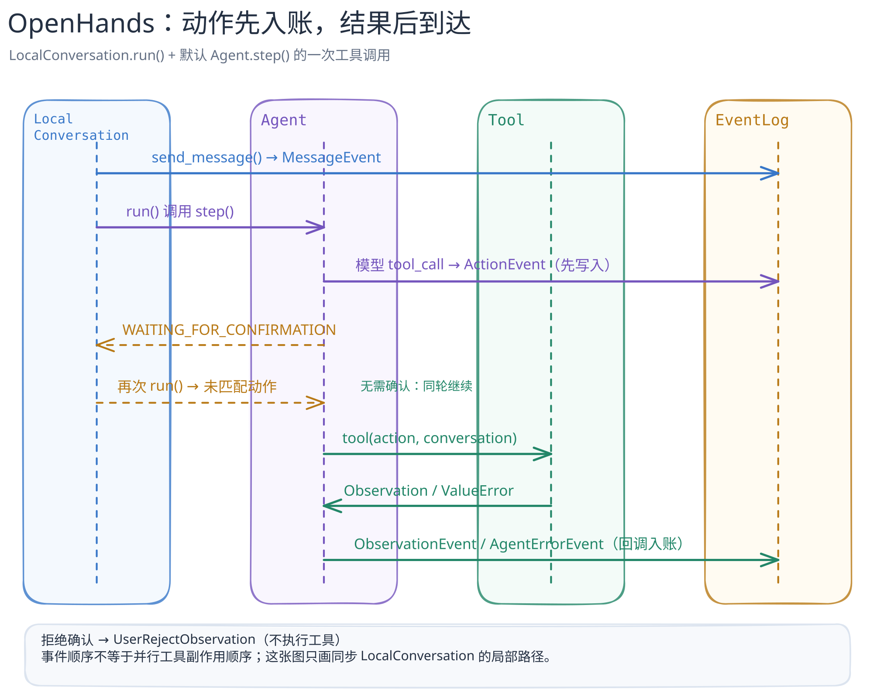

# OpenHands：为什么先记录动作，再执行工具？

[返回系统目录](../README.md) · [跟读代码](code-walkthrough.md) · [图的文字版](../../../figures/openhands-action-events/README.md)

> 固定研究版本：Agent 内核以官方 [`OpenHands/software-agent-sdk@6ebd820d10794f1b52bb06ef6c19512888a1401b`](https://github.com/OpenHands/software-agent-sdk/tree/6ebd820d10794f1b52bb06ef6c19512888a1401b) 为准；仓库分工以官方 [`OpenHands/OpenHands@928873b4c2efb5a17ffa93eb541c78bb43a109f3`](https://github.com/OpenHands/OpenHands/tree/928873b4c2efb5a17ffa93eb541c78bb43a109f3) 为准，核对日期 2026-09-23。本篇是**源码静态阅读**，只讨论 SDK 内 `LocalConversation.run()` + 默认 `Agent.step()` 的一条局部路径，不是 Agent Canvas、远程 Agent Server 或所有 Agent 后端的实测。

## 30 秒读懂

在这条实现路径里，模型的工具调用先被转换并发出 `ActionEvent`，再检查是否需要用户确认。若需要，`LocalConversation` 进入 `WAITING_FOR_CONFIRMATION`，本次 `run()` 在工具执行前退出。下一次获准 `run()`，`Agent.step()` 从当前分支找没有对应结果的动作，先执行这些动作，再考虑向模型采样新动作。工具返回 `Observation` 后，由 Agent 包装成 `ObservationEvent`（或错误事件），经会话回调记录进事件历史。因此“模型提出动作”“动作已记录”“工具实际做了事”是三个可区分的时刻。[生成并发出 ActionEvent](https://github.com/OpenHands/software-agent-sdk/blob/6ebd820d10794f1b52bb06ef6c19512888a1401b/openhands-sdk/openhands/sdk/agent/agent.py#L1227-L1382) · [确认闸门](https://github.com/OpenHands/software-agent-sdk/blob/6ebd820d10794f1b52bb06ef6c19512888a1401b/openhands-sdk/openhands/sdk/agent/response_dispatch.py#L163-L190) · [下轮先处理未匹配动作](https://github.com/OpenHands/software-agent-sdk/blob/6ebd820d10794f1b52bb06ef6c19512888a1401b/openhands-sdk/openhands/sdk/agent/agent.py#L645-L661)

[可编辑图源](../../../figures/openhands-action-events/scene.excalidraw) · [PNG 预览](../../../figures/openhands-action-events/preview.png) · [不看图的说明](../../../figures/openhands-action-events/README.md)

## 这个边界有什么价值

事件不只是 UI 聊天记录。`LocalConversation` 的默认回调先 `append_event()`，再运行外部回调；当前分支中的 `ActionEvent` 与 `ObservationEvent` / `UserRejectObservation` / `AgentErrorEvent` 可以按 ID 配对，找出尚未完成的动作。[回调顺序](https://github.com/OpenHands/software-agent-sdk/blob/6ebd820d10794f1b52bb06ef6c19512888a1401b/openhands-sdk/openhands/sdk/conversation/impl/local_conversation.py#L415-L468) · [匹配规则](https://github.com/OpenHands/software-agent-sdk/blob/6ebd820d10794f1b52bb06ef6c19512888a1401b/openhands-sdk/openhands/sdk/conversation/state.py#L677-L716)。“入账”只表示进入 `EventLog`：未配置持久化目录时可使用 `InMemoryFileStore`，不能理解成每次都已写到磁盘。[存储回退](https://github.com/OpenHands/software-agent-sdk/blob/6ebd820d10794f1b52bb06ef6c19512888a1401b/openhands-sdk/openhands/sdk/conversation/state.py#L506-L541)

这是基于源码的**工程解读**：把意图、效果和确认状态分离，为暂停、拒绝和恢复提供了明确的状态边界。它不是“恰好执行一次”的保证，也不能证明所有工具都可靠隔离。以 `TerminalTool` 为例，执行器的工作目录取自 `conv_state.workspace.working_dir`；实际隔离取决于选择的 workspace/部署模式，不能把工作目录等同于沙箱。[TerminalTool 初始化](https://github.com/OpenHands/software-agent-sdk/blob/6ebd820d10794f1b52bb06ef6c19512888a1401b/openhands-tools/openhands/tools/terminal/definition.py#L294-L330) · [Canvas 对无沙箱本地模式的警告](https://github.com/OpenHands/OpenHands/blob/928873b4c2efb5a17ffa93eb541c78bb43a109f3/README.md#L63-L66)

## 仓库边界

当前 `OpenHands/OpenHands` 是 Agent Canvas 前端与本地栈编排；Agent、工具、会话、workspace 和事件的权威实现已在 `software-agent-sdk`。本文故意不把 Canvas 的事件展示组件画成执行内核。[官方仓库分工](https://github.com/OpenHands/OpenHands/blob/928873b4c2efb5a17ffa93eb541c78bb43a109f3/README.md#L140-L150)

下一步可读[关键代码路径](code-walkthrough.md)；后续再分别研究 Agent Server 的远程生命周期、工具/插件装配，以及 workspace 的隔离模型。
