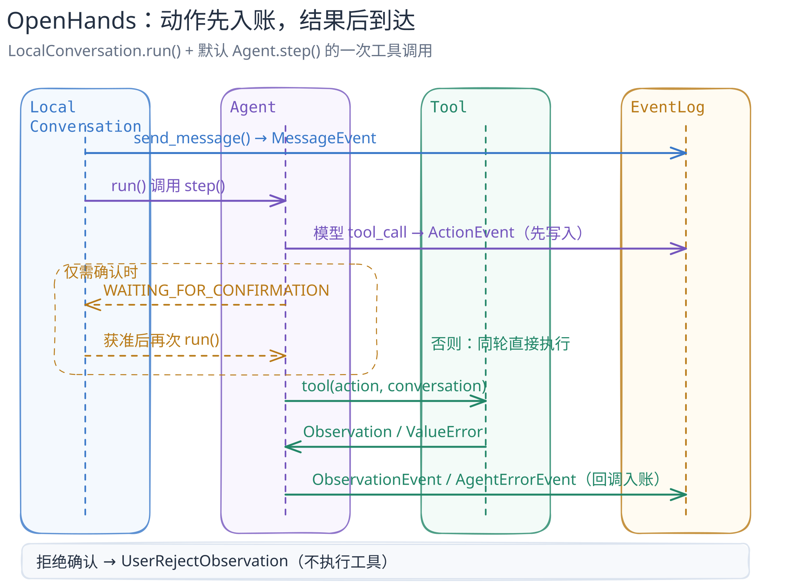

# OpenHands：先记下要做的事，再执行并记结果

[返回系统目录](../README.md) · [跟读代码](code-walkthrough.md) · [图的文字版](../../../figures/openhands-action-events/README.md)

假设模型提出一项修改文件的工具调用。OpenHands 先把“准备做这件事”记进事件清单；如果需要用户确认，就先暂停。允许执行后，工具去做事，程序再把返回结果记入清单，与前面的动作配对。

这样，读者既能看到助手打算做什么，也能找到对应结果。本篇用这条流程解释 OpenHands SDK 的动作与事件设计。

## 一项动作怎样走完

动作记录叫 `ActionEvent`，工具返回的观察结果叫 `Observation`，结果记录叫 `ObservationEvent`。正常流程是：记录动作，检查确认条件，执行工具，记录结果。

需要确认时，负责管理会话的 `LocalConversation` 进入 `WAITING_FOR_CONFIRMATION`（等待确认），本次 `run()` 在执行工具前停下。宿主程序得到用户批准后，才能再次调用 `run()`；这条同步路径把再次调用视为批准。随后 `Agent.step()` 找回还没有结果的动作，先执行它们，再向模型请求下一步。[创建动作记录](https://github.com/OpenHands/software-agent-sdk/blob/6ebd820d10794f1b52bb06ef6c19512888a1401b/openhands-sdk/openhands/sdk/agent/agent.py#L1227-L1382) · [检查确认条件](https://github.com/OpenHands/software-agent-sdk/blob/6ebd820d10794f1b52bb06ef6c19512888a1401b/openhands-sdk/openhands/sdk/agent/response_dispatch.py#L163-L190) · [先处理待办动作](https://github.com/OpenHands/software-agent-sdk/blob/6ebd820d10794f1b52bb06ef6c19512888a1401b/openhands-sdk/openhands/sdk/agent/agent.py#L645-L661)

[可编辑图源](../../../figures/openhands-action-events/scene.excalidraw) · [PNG 预览](../../../figures/openhands-action-events/preview.png) · [不看图的说明](../../../figures/openhands-action-events/README.md)

## 事件清单怎样帮上忙

`LocalConversation` 收到事件后，默认先用 `append_event()` 加入清单，再通知外部订阅者。动作和结果用编号（ID）配对；用户拒绝的记录 `UserRejectObservation`、工具错误记录 `AgentErrorEvent` 也能对应到原动作。程序由此找出当前分支上还有哪些动作没有结果。[保存与通知顺序](https://github.com/OpenHands/software-agent-sdk/blob/6ebd820d10794f1b52bb06ef6c19512888a1401b/openhands-sdk/openhands/sdk/conversation/impl/local_conversation.py#L415-L468) · [按编号找待办动作](https://github.com/OpenHands/software-agent-sdk/blob/6ebd820d10794f1b52bb06ef6c19512888a1401b/openhands-sdk/openhands/sdk/conversation/state.py#L677-L716)

从这段代码看，分别记录动作、结果和确认状态，有助于应用解释“停在哪里、继续做哪一项”。这是本书的工程解读。事件清单是否落盘取决于配置：没有设置持久化目录时，可以用 `InMemoryFileStore` 保存在内存中。[存储选择](https://github.com/OpenHands/software-agent-sdk/blob/6ebd820d10794f1b52bb06ef6c19512888a1401b/openhands-sdk/openhands/sdk/conversation/state.py#L506-L541)

## 读源码时先找对仓库

这个版本的 `OpenHands/OpenHands` 负责 Agent Canvas 界面和本地服务组合；Agent、工具、会话、工作空间（workspace）和事件实现位于 `software-agent-sdk`。要理解工具真正怎么执行，先到 SDK 里读。[官方仓库分工](https://github.com/OpenHands/OpenHands/blob/928873b4c2efb5a17ffa93eb541c78bb43a109f3/README.md#L140-L150)

下一篇[代码导读](code-walkthrough.md)带你找这些事件的产生和处理位置。使用时还需检查实际执行环境：`TerminalTool` 从 `conv_state.workspace.working_dir` 取得工作目录，目录设置本身只决定“在哪里运行”。文件和网络能访问到哪里，取决于 workspace 和部署模式；官方也提示无沙箱本地模式的风险。[TerminalTool 初始化](https://github.com/OpenHands/software-agent-sdk/blob/6ebd820d10794f1b52bb06ef6c19512888a1401b/openhands-tools/openhands/tools/terminal/definition.py#L294-L330) · [本地模式提醒](https://github.com/OpenHands/OpenHands/blob/928873b4c2efb5a17ffa93eb541c78bb43a109f3/README.md#L63-L66)

本文尚未运行确认或故障恢复测试。恢复时是否会重复执行外部操作，需要结合工具设计另外核对；远程 Agent Server 也需单独阅读。

## 来源与阅读范围

本文的 Agent 代码依据官方 [`OpenHands/software-agent-sdk@6ebd820d10794f1b52bb06ef6c19512888a1401b`](https://github.com/OpenHands/software-agent-sdk/tree/6ebd820d10794f1b52bb06ef6c19512888a1401b)，仓库分工依据 [`OpenHands/OpenHands@928873b4c2efb5a17ffa93eb541c78bb43a109f3`](https://github.com/OpenHands/OpenHands/tree/928873b4c2efb5a17ffa93eb541c78bb43a109f3)，核对日期 2026-09-23。本篇只静态阅读了同步 `LocalConversation.run()` 与默认 `Agent.step()` 的相关路径；Canvas 界面、远程服务和其他后端需分别研究。
