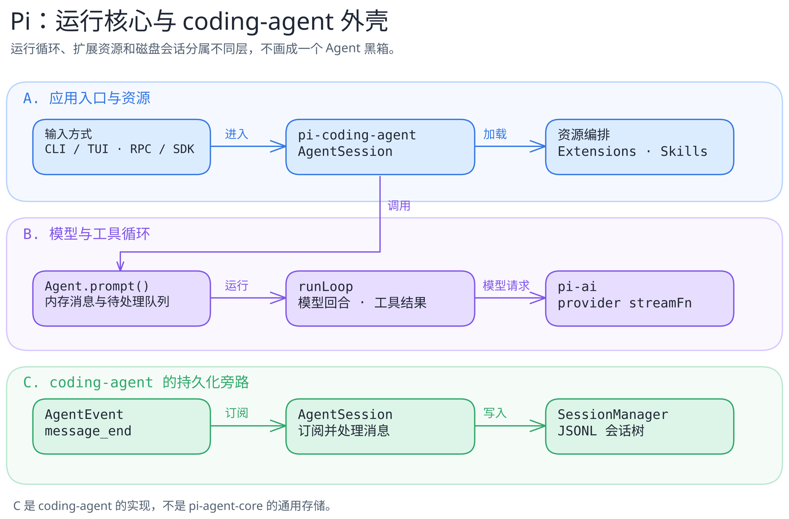

# Pi：小核心与可扩展外壳

[返回系统目录](../README.md) · [实施计划](../../pi-first.md) · [关键代码导读](code-walkthrough.md)

Pi 的第一篇从“哪些状态属于核心、哪些由 coding-agent 负责”讲起。核心的 `Agent` 接受输入、管理内存消息和运行队列；`runLoop` 组织模型回合、工具调用及继续/结束；coding-agent 的 `AgentSession` 另行编排资源和会话持久化。把三者混作一个“Agent 大盒子”，就很难解释 Extension、Skill 和 session tree 各在哪里起作用。

> 固定研究版本：官方仓库 [`earendil-works/pi@898ab804050730e9dcefb4443875d5a932aa6a32`](https://github.com/earendil-works/pi/tree/898ab804050730e9dcefb4443875d5a932aa6a32)，核对日期 2026-09-23。旧 `badlogic/pi-mono` 已迁移，参见[官方公告](https://pi.dev/news/2026/5/7/pi-has-a-new-home)。下文目前是源码静态阅读，不是运行评测。

## 先看三个边界

| 层 | 负责什么 | 本篇证据 |
| --- | --- | --- |
| `pi-ai` | 模型与 provider 的统一调用接口 | [仓库包说明](https://github.com/earendil-works/pi/blob/898ab804050730e9dcefb4443875d5a932aa6a32/README.md)、[agent-core 请求边界](https://github.com/earendil-works/pi/blob/898ab804050730e9dcefb4443875d5a932aa6a32/packages/agent/src/agent-loop.ts#L380-L406) |
| `pi-agent-core` | `Agent` 的内存状态和队列、`runLoop` 的模型/工具回合与事件 | [`Agent.prompt()`](https://github.com/earendil-works/pi/blob/898ab804050730e9dcefb4443875d5a932aa6a32/packages/agent/src/agent.ts#L367-L442)、[`runLoop`](https://github.com/earendil-works/pi/blob/898ab804050730e9dcefb4443875d5a932aa6a32/packages/agent/src/agent-loop.ts#L162-L320) |
| `pi-coding-agent` | 终端应用、资源编排与 coding 会话持久化 | [`AgentSession` 事件处理](https://github.com/earendil-works/pi/blob/898ab804050730e9dcefb4443875d5a932aa6a32/packages/coding-agent/src/core/agent-session.ts#L921-L943)、[`SessionManager`](https://github.com/earendil-works/pi/blob/898ab804050730e9dcefb4443875d5a932aa6a32/packages/coding-agent/src/core/session-manager.ts#L1189-L1211) |

## 最值得跟读的一条路径

调用 `Agent.prompt()` 后，模型输入先由 `transformContext` 与 `convertToLlm` 准备，再交给流式模型接口；若模型返回工具调用，运行时完成校验、前置拦截、执行和后置处理，再把 tool result 送回下一轮。steering 在轮间被检查；follow-up 则在本来即将结束时被检查。coding-agent 订阅 `message_end` 后才把消息交给自己的会话管理器。[按函数与分支读代码](code-walkthrough.md)

[图源](../../../figures/pi-architecture/scene.excalidraw) · [PNG 预览](../../../figures/pi-architecture/preview.png) · [不看图的说明](../../../figures/pi-architecture/README.md)

## 接下来读什么

- [关键代码导读](code-walkthrough.md)：从 `prompt()` 进入 loop，读模型请求、工具结果、队列和持久化边界。
- [Extensions、Skills 与 Packages](extensions-and-skills.md)：可执行扩展与按需指令的职责不同，不能都叫“插件”。

## 值得学的取舍

Pi 的吸引力不是“功能比别人少”本身，而是把循环留在可读的核心，把交互、会话、扩展资源放到外壳，让读者能沿一条具体路径追踪状态和副作用；这是基于上述源码边界的**工程判断**，不是性能评测。代价也清楚：[官方仓库说明](https://github.com/earendil-works/pi/blob/898ab804050730e9dcefb4443875d5a932aa6a32/README.md)写明 Pi 默认沿启动它的用户/进程权限运行，不内置限制文件、进程、网络和凭据访问的权限系统。第三方 Extension 和 Skill 不能因为安装方便就跳过审查。

本篇不把 Pi 的 JSONL coding 会话树说成所有嵌入场景的唯一后端，也不把静态源码阅读包装成可靠性或性能证明。
