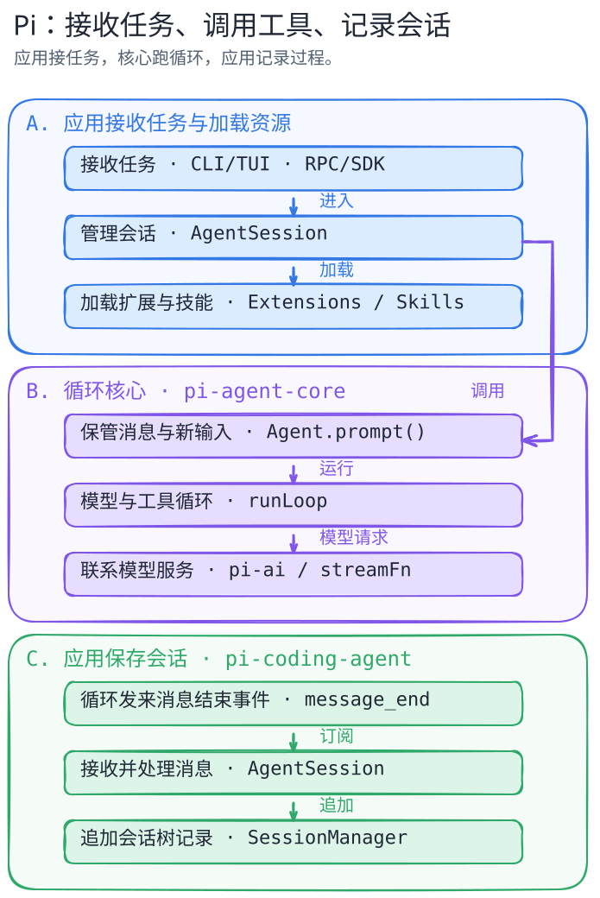

# Pi：小核心与可扩展外壳

[返回系统目录](../README.md) · [关键代码导读](code-walkthrough.md)

假设你让 Pi 读一个文件，再修改代码。背后有三部分合作：模型接口负责联系模型；运行核心把模型提出的工具调用交给程序执行，再把结果送回模型；终端应用管理当前会话、扩展资源和文件记录。

Pi 把这三部分拆成独立的包。本篇先看它们如何合作，再到下一篇看循环里的具体函数。即使暂时不读源码，也可以先弄清楚：模型在提建议，工具在做事，应用在保存这次工作的过程。

## 三部分各做什么

| 层 | 负责什么 | 本篇证据 |
| --- | --- | --- |
| `pi-ai` | 用统一接口联系不同模型服务商（provider） | [仓库包说明](https://github.com/earendil-works/pi/blob/898ab804050730e9dcefb4443875d5a932aa6a32/README.md)、[准备模型请求](https://github.com/earendil-works/pi/blob/898ab804050730e9dcefb4443875d5a932aa6a32/packages/agent/src/agent-loop.ts#L380-L406) |
| `pi-agent-core` | `Agent` 保管当前消息和待处理输入；`runLoop` 安排模型与工具的一轮轮工作 | [`Agent.prompt()`](https://github.com/earendil-works/pi/blob/898ab804050730e9dcefb4443875d5a932aa6a32/packages/agent/src/agent.ts#L367-L442)、[`runLoop`](https://github.com/earendil-works/pi/blob/898ab804050730e9dcefb4443875d5a932aa6a32/packages/agent/src/agent-loop.ts#L162-L320) |
| `pi-coding-agent` | 提供终端应用，加载资源，并用 `AgentSession`、`SessionManager` 管理和保存会话 | [`AgentSession` 处理消息](https://github.com/earendil-works/pi/blob/898ab804050730e9dcefb4443875d5a932aa6a32/packages/coding-agent/src/core/agent-session.ts#L921-L943)、[`SessionManager`](https://github.com/earendil-works/pi/blob/898ab804050730e9dcefb4443875d5a932aa6a32/packages/coding-agent/src/core/session-manager.ts#L1189-L1211) |

## 一次任务怎样往下走

`Agent.prompt()` 收到你的任务后，先整理要交给模型的消息。源码里，这一步叫 `transformContext` 和 `convertToLlm`。模型可以直接回答，也可以要求调用工具，例如读取文件。

有工具调用时，程序先核对工具和参数，并运行已配置的前置检查；通过后才执行工具。读取到的内容会成为工具结果（tool result），放进下一轮模型输入。模型因此能根据真实文件内容继续工作。

你在工作途中补充的话也有安排：steering 用于轮间调整方向，follow-up 留到本次工作原本准备结束时处理。终端应用收到消息结束事件 `message_end` 后，把消息交给会话管理器保存。[按函数跟读这条路径](code-walkthrough.md)

[图源](../../../figures/pi-architecture/scene.excalidraw) · [PNG 预览](../../../figures/pi-architecture/preview.png) · [不看图的说明](../../../figures/pi-architecture/README.md)

## 接下来读什么

- [关键代码导读](code-walkthrough.md)：跟着 `prompt()` 看模型请求、工具结果、新输入和会话保存。
- [Extensions、Skills 与 Packages](extensions-and-skills.md)：分别看工作指导、代码扩展和安装包。

## 值得学的取舍

从这些代码看，Pi 的一个吸引人之处是分工清楚：想换界面、增加工具或调整会话策略时，可以找到对应的部分；想理解循环本身，也有相对集中的代码可读。这是本书的工程解读，口碑和性能还需要另外的使用反馈与评测。

使用时尤其要注意进程权限：[官方仓库说明](https://github.com/earendil-works/pi/blob/898ab804050730e9dcefb4443875d5a932aa6a32/README.md)写明，Pi 默认使用启动它的用户所拥有的文件、进程、网络和凭据权限，没有内置的权限限制系统。安装第三方 Extension 或 Skill 前，应检查来源和它会执行的操作。本文介绍的 JSONL 会话树属于终端 coding-agent；把核心嵌入其他应用时，可以另选存储方式。

## 来源与阅读范围

本文依据官方仓库 [`earendil-works/pi@898ab804050730e9dcefb4443875d5a932aa6a32`](https://github.com/earendil-works/pi/tree/898ab804050730e9dcefb4443875d5a932aa6a32)，核对日期 2026-09-23。旧仓库 `badlogic/pi-mono` 已迁移，见[官方公告](https://pi.dev/news/2026/5/7/pi-has-a-new-home)。这里介绍的是固定版本源码中的分工和调用流程，尚未运行评测。
