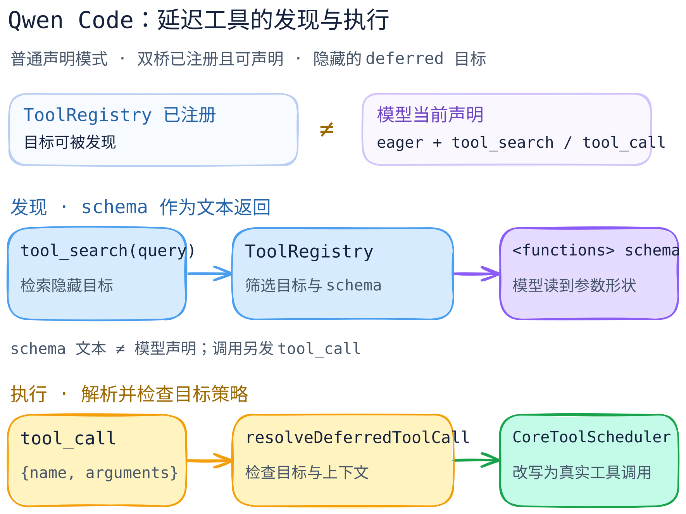

# Qwen Code：延迟工具为何要分“发现”和“执行”？

> 固定官方仓库 [`QwenLM/qwen-code@b9840886b86c23f196482cc1ee55d59cbc74df87`](https://github.com/QwenLM/qwen-code/tree/b9840886b86c23f196482cc1ee55d59cbc74df87)。本篇只看普通工具声明模式下 `ToolRegistry → tool_search → tool_call → CoreToolScheduler` 的延迟工具桥；是静态源码剖面，不是运行实测。

[图的文字版](../../../figures/qwen-code-deferred-tools/README.md) · [可编辑图源](../../../figures/qwen-code-deferred-tools/scene.excalidraw) · [关键代码导读](code-walkthrough.md)

## 一个工具有三种不同的“存在”

工具可以已经注册，却不在当前发给模型的 function-declaration 列表中。`ToolRegistry.getFunctionDeclarations()` 默认过滤仍隐藏的 deferred 工具；`shouldDefer`、`alwaysLoad`、会话 reveal、`visibleTools` 等一起决定它是否在列表内。MCP 工具构造时设置 `shouldDefer=true`，但 `alwaysLoad` 等例外仍可能使其可见。[声明过滤](https://github.com/QwenLM/qwen-code/blob/b9840886b86c23f196482cc1ee55d59cbc74df87/packages/core/src/tools/tool-registry.ts#L835-L869) · [隐藏判定](https://github.com/QwenLM/qwen-code/blob/b9840886b86c23f196482cc1ee55d59cbc74df87/packages/core/src/tools/tool-registry.ts#L955-L974) · [MCP 工具](https://github.com/QwenLM/qwen-code/blob/b9840886b86c23f196482cc1ee55d59cbc74df87/packages/core/src/tools/mcp-tool.ts#L1015-L1035)

`tool_search` 可按关键词或 `select:<name>` 找 schema；关键词模式的候选是仍隐藏的 deferred 工具，精确模式也允许重看已可见工具。返回的是 `<functions>` 包裹的 schema 文本，**不是**将工具加入模型当前声明列表，更不是执行工具。[查询模式](https://github.com/QwenLM/qwen-code/blob/b9840886b86c23f196482cc1ee55d59cbc74df87/packages/core/src/tools/tool-search.ts#L129-L139) · [隐藏候选](https://github.com/QwenLM/qwen-code/blob/b9840886b86c23f196482cc1ee55d59cbc74df87/packages/core/src/tools/tool-search.ts#L258-L293) · [schema 返回](https://github.com/QwenLM/qwen-code/blob/b9840886b86c23f196482cc1ee55d59cbc74df87/packages/core/src/tools/tool-search.ts#L295-L411)

模型随后用 `tool_call {name, arguments}` 调用仍隐藏的目标。`resolveDeferredToolCall()` 会核对桥、目标、上下文排除规则、deferred/hidden 状态及声明能力；可见工具反而要求直接调用。调度器把 wrapper 请求改写成真实工具名和参数，再走目标工具的调度/权限路径。`ToolCallTool.execute()` 自己拒绝直接执行，防止绕开调度器。[解析与拒绝](https://github.com/QwenLM/qwen-code/blob/b9840886b86c23f196482cc1ee55d59cbc74df87/packages/core/src/tools/tool-call.ts#L60-L211) · [调度改写](https://github.com/QwenLM/qwen-code/blob/b9840886b86c23f196482cc1ee55d59cbc74df87/packages/core/src/core/coreToolScheduler.ts#L2645-L2729) · [不许直执行](https://github.com/QwenLM/qwen-code/blob/b9840886b86c23f196482cc1ee55d59cbc74df87/packages/core/src/tools/tool-call.ts#L214-L230)

## 设计取舍

这是一个“工具已注册，但完整 schema 按需给模型看”的折中：减少初始声明体积，同时保留发现和调用入口。源码在 `setTools()` 中取得注册表的声明列表，并向模型聊天对象设置它；`tool_search` 的文本回答本身不调用 `setTools()`。[setTools](https://github.com/QwenLM/qwen-code/blob/b9840886b86c23f196482cc1ee55d59cbc74df87/packages/core/src/core/client.ts#L1181-L1204) · [tool_search 实现](https://github.com/QwenLM/qwen-code/blob/b9840886b86c23f196482cc1ee55d59cbc74df87/packages/core/src/tools/tool-search.ts#L295-L411)

但这不是绝对的“deferred 永远隐藏”：小规模 deferred schema 可被预算预加载，历史回放或会话 setup 也可 reveal；`CodeModeOnly` 有不同声明路径。[预算预加载](https://github.com/QwenLM/qwen-code/blob/b9840886b86c23f196482cc1ee55d59cbc74df87/packages/core/src/tools/tool-registry.ts#L1032-L1085) · [模式分支](https://github.com/QwenLM/qwen-code/blob/b9840886b86c23f196482cc1ee55d59cbc74df87/packages/core/src/tools/tool-registry.ts#L850-L903)

## 边界

这里的“发现”专指**已注册工具 schema** 的按需检索，不等同于 Skill 文件发现或插件加载；没有验证 MCP 重连、权限弹窗、hooks 的实际顺序，也不声称模型一定先调用 `tool_search` 才会试 `tool_call`。拒绝分支是在调度器里兜底检查，执行后的权限、审批和 hook 结果仍须另做实测。[桥语义](https://github.com/QwenLM/qwen-code/blob/b9840886b86c23f196482cc1ee55d59cbc74df87/packages/core/src/tools/tool-search.ts#L129-L139) · [目标策略检查](https://github.com/QwenLM/qwen-code/blob/b9840886b86c23f196482cc1ee55d59cbc74df87/packages/core/src/core/coreToolScheduler.ts#L2706-L2729)
