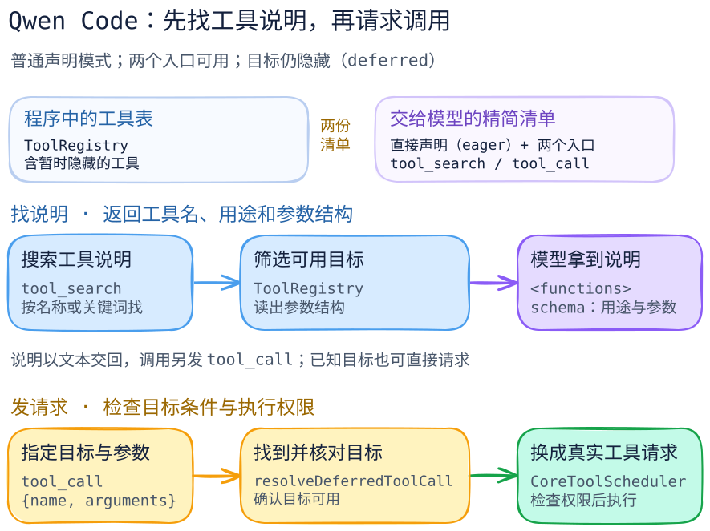

# Qwen Code：工具很多时，先找说明再调用

工具越多，把所有说明都一次交给模型就越占空间。Qwen Code 在这里提供了一种做法：工具先注册到程序里，部分完整说明留到需要时再给模型看。模型可以搜索这些说明，然后请求调用目标工具。

“延迟工具”（deferred tool）说的就是暂时不出现在模型工具声明列表里的已注册工具。本篇看它怎样被找到、怎样交给执行程序。

> 固定官方仓库 [`QwenLM/qwen-code@b9840886b86c23f196482cc1ee55d59cbc74df87`](https://github.com/QwenLM/qwen-code/tree/b9840886b86c23f196482cc1ee55d59cbc74df87)。本篇依据静态源码，介绍普通工具声明模式下 `ToolRegistry → tool_search → tool_call → CoreToolScheduler` 的流程，尚未运行验证。

[图的文字版](../../../figures/qwen-code-deferred-tools/README.md) · [可编辑图源](../../../figures/qwen-code-deferred-tools/scene.excalidraw) · [关键代码导读](code-walkthrough.md)

## 第一步：程序保管工具，模型先看精简清单

`ToolRegistry` 是程序保存工具的注册表。发送模型工具声明时，`getFunctionDeclarations()` 会筛掉仍隐藏的延迟工具。`shouldDefer` 表示希望延迟加载，`alwaysLoad` 表示始终加载，会话里已经显示的工具与 `visibleTools` 配置也会影响这份清单。

MCP 连接进来的工具默认设置 `shouldDefer=true`，仍会受“始终加载”等条件影响。MCP 是让应用接入外部工具与资源的协议。[准备工具清单](https://github.com/QwenLM/qwen-code/blob/b9840886b86c23f196482cc1ee55d59cbc74df87/packages/core/src/tools/tool-registry.ts#L835-L869) · [决定暂时隐藏哪些工具](https://github.com/QwenLM/qwen-code/blob/b9840886b86c23f196482cc1ee55d59cbc74df87/packages/core/src/tools/tool-registry.ts#L955-L974) · [MCP 工具配置](https://github.com/QwenLM/qwen-code/blob/b9840886b86c23f196482cc1ee55d59cbc74df87/packages/core/src/tools/mcp-tool.ts#L1015-L1035)

## 第二步：用搜索拿到调用说明

模型可以用 `tool_search` 搜索工具。关键词搜索从仍隐藏的延迟工具中找候选；`select:<name>` 可以按名称精确查看，也允许重看已显示工具的说明。

返回内容是 schema，也就是工具名称、用途和参数结构，放在 `<functions>` 文本里交给模型。到这一步，模型拿到了说明；目标工具还没有执行，模型原来的工具声明列表也保持原样。[搜索方式](https://github.com/QwenLM/qwen-code/blob/b9840886b86c23f196482cc1ee55d59cbc74df87/packages/core/src/tools/tool-search.ts#L129-L139) · [寻找候选](https://github.com/QwenLM/qwen-code/blob/b9840886b86c23f196482cc1ee55d59cbc74df87/packages/core/src/tools/tool-search.ts#L258-L293) · [返回工具说明](https://github.com/QwenLM/qwen-code/blob/b9840886b86c23f196482cc1ee55d59cbc74df87/packages/core/src/tools/tool-search.ts#L295-L411)

## 第三步：通过调用入口交给真正的工具

模型用 `tool_call {name, arguments}` 请求调用仍隐藏的目标，分别写明工具名和参数。`resolveDeferredToolCall()` 检查两个入口是否齐全、目标是否符合条件，以及当前 Agent 是否可以使用它。已经显示的工具则直接调用。

通过检查后，调度器把这层包装换成真实工具名和参数，再按目标工具的权限与执行规则继续处理。`ToolCallTool.execute()` 本身拒绝直接执行，实际调用必须经过调度器。[解析目标与条件](https://github.com/QwenLM/qwen-code/blob/b9840886b86c23f196482cc1ee55d59cbc74df87/packages/core/src/tools/tool-call.ts#L60-L211) · [换成真实工具请求](https://github.com/QwenLM/qwen-code/blob/b9840886b86c23f196482cc1ee55d59cbc74df87/packages/core/src/core/coreToolScheduler.ts#L2645-L2729) · [限制直接执行](https://github.com/QwenLM/qwen-code/blob/b9840886b86c23f196482cc1ee55d59cbc74df87/packages/core/src/tools/tool-call.ts#L214-L230)

## 设计取舍

搜索和调用两个入口都可用时，这种设计可以先少发一些工具声明，再按需要把完整说明交给模型。代价是模型要理解搜索与调用的用法，程序也多了一层目标检查。

源码中，`setTools()` 负责设置模型原生工具声明，`tool_search` 负责返回说明文本。想看两者分别怎么做，可以对照[声明筛选](https://github.com/QwenLM/qwen-code/blob/b9840886b86c23f196482cc1ee55d59cbc74df87/packages/core/src/tools/tool-registry.ts#L835-L869)、[setTools](https://github.com/QwenLM/qwen-code/blob/b9840886b86c23f196482cc1ee55d59cbc74df87/packages/core/src/core/client.ts#L1181-L1204)和[搜索实现](https://github.com/QwenLM/qwen-code/blob/b9840886b86c23f196482cc1ee55d59cbc74df87/packages/core/src/tools/tool-search.ts#L295-L411)。

也有工具提前显示的情况：说明体积较小时，可以按预算预加载；会话初始化或历史回放也可以显示工具。`CodeModeOnly` 模式采用另一套声明流程。[预算预加载](https://github.com/QwenLM/qwen-code/blob/b9840886b86c23f196482cc1ee55d59cbc74df87/packages/core/src/tools/tool-registry.ts#L1032-L1085) · [模式选择](https://github.com/QwenLM/qwen-code/blob/b9840886b86c23f196482cc1ee55d59cbc74df87/packages/core/src/tools/tool-registry.ts#L850-L903)

## 读到这里，先记住分工

`tool_search` 让模型读说明，`tool_call` 交出调用请求，调度器检查真实目标并安排执行。目标权限要在执行前检查。模型也可能没有先搜索就尝试调用，因此程序仍需核对每次请求。[搜索与调用约定](https://github.com/QwenLM/qwen-code/blob/b9840886b86c23f196482cc1ee55d59cbc74df87/packages/core/src/tools/tool-search.ts#L129-L139) · [检查目标权限](https://github.com/QwenLM/qwen-code/blob/b9840886b86c23f196482cc1ee55d59cbc74df87/packages/core/src/core/coreToolScheduler.ts#L2706-L2729)

这页讲的是寻找已注册工具的说明。Skill 文件的发现、插件加载是另外的流程。实际节省多少输入空间、模型使用得是否稳定，以及 MCP 重连和审批体验，都还需要运行评测。
