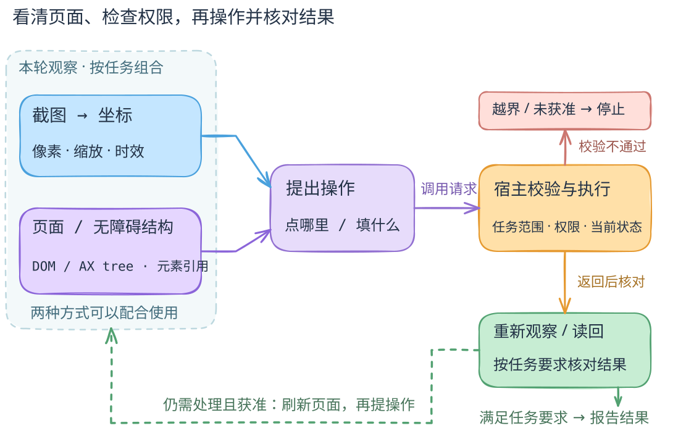

# 两种观察通道可混用，动作仍须授权与验收

[机制正文](../../docs/concepts/computer-and-browser-use.md) · [SVG](diagram.svg) · [PNG](preview.png) · [图源](scene.excalidraw)

## 文字版

左侧是可按任务组合的观察通道：截图支持视觉目标与坐标；DOM／辅助功能树提供元素、角色及引用。这不是互斥产品分类，也不表示所有桌面系统都能获得网页 DOM。操作系统辅助功能接口、CDP 等更详细区别放在正文，图中不声称它们是同一个 API。

观察进入模型，产生“点哪里、填什么”的动作提案。提案经宿主按任务范围、权限与当前状态校验，才进入执行；校验不通过的分支停下并说明原因。高风险是否需要人工确认由具体合同和系统策略确定，图只表示未获准的动作不能继续。

执行回执不等于任务完成。宿主或获准的观察器重新观察／读回，按任务判据核对结果。绿色虚线代表后续循环刷新观察，而非复用已过时的坐标和元素引用；符合停止条件时可以结束，不必无限循环。

## 范围、证据与导出

这是本书原创教学抽象，不是统一产品架构或运行录像。固定来源与机制映射见正文：Anthropic Computer Use 的应用侧工具执行与坐标缩放、Playwright MCP 的快照和 profile、Chrome DevTools MCP 的浏览器检查、Browser Use 的超时与动作守卫。

`build.py` 生成可编辑原生场景；SVG 与 4× PNG 使用 `excalidraw-agent` 的固定原生导出器生成。图使用轻手绘框线与箭头、Normal 6／Code 8 文本，并按实际 PNG 检查裁切、连线和字形。MCP 交互画布有字体限制，本地导出检查不代表 MCP 像素验收。
